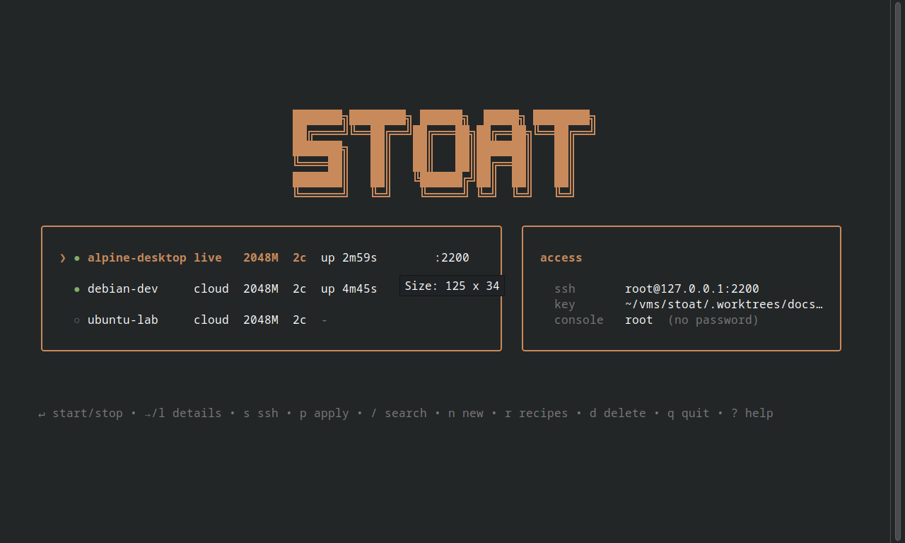

# stoat

Stoat is a CLI for running local QEMU virtual machines, built for people and
AI agents. Use its TUI for interactive work, JSON CLI output for automation,
or MCP tools from an agent.

It manages disposable Alpine sessions and persistent Linux guests through
plain TOML files. One Go binary starts QEMU directly.

[Get started](docs/getting-started/installation.md) ·
[Documentation](docs/README.md) ·
[CLI reference](docs/reference/cli.md) ·
[Releases](https://github.com/NovusEdge/stoat/releases)



## Install and check

Stoat runs on Linux with KVM, QEMU, OpenSSH, and `xorriso` for cloud images.
Building from source needs Go 1.26 or newer, Git, and Just.

```sh
git clone https://github.com/NovusEdge/stoat.git
cd stoat
just setup
```

`just setup` builds Stoat, installs it under `~/.local/bin`, checks host
dependencies, and offers to add that directory to `PATH`. Open a new shell if
your shell configuration changed, then run:

```sh
stoat doctor
```

See [installation](docs/getting-started/installation.md) for host packages,
release archives, Nix, and KVM permission details.

## Start a Debian VM

```sh
stoat pull debian-13
stoat create dev --image debian-13 --ram 2048 --cpus 2
stoat up dev
stoat wait dev --until reachable --timeout 2m
stoat exec dev -- cat /etc/debian_version
stoat down dev
```

`create` writes the VM without starting it. `wait --until reachable` confirms
that SSH answers. `down` retains the disk; `stoat rm dev` deletes a stopped VM
after confirmation. [Your first VM](docs/getting-started/first-vm.md) covers
recipes, display access, and expected results.

## Use the TUI

Run `stoat` with no subcommand. Press `n` to choose an image, **Space** to
download it, and **Enter** to create it. Press **Enter** on the list to
start or stop the selected VM, `s` to open SSH, `p` to apply recipes, and `r`
to edit the recipes directory in `$EDITOR`. Press `?` for help and `q` to quit.

For repository-managed VMs, declare `[vms.<key>]` in `stoat.toml` and commit
the file. `stoat up`, `status`, and `down` then reconcile and operate on the
declared VMs. See the [project file reference](docs/reference/project-file.md).

## Recipes, MCP, and scripts

- [Recipe overview](docs/recipes/overview.md) explains targeting, parameters,
  secrets, outputs, health checks, and persistence.
- [Sharing recipes](docs/recipes/sharing.md) covers remote refs, two scopes,
  lock, sync, search, update, and removal.
- [MCP reference](docs/reference/mcp.md) covers client setup, transports,
  project tools, and agent access levels.
- [JSON output](docs/reference/json.md) documents the CLI contract and DTOs.
- [Troubleshooting](docs/troubleshooting.md) covers boot, SSH, display, and
  provisioning failures.

## See it running

The recording shows Stoat's TUI list and detail screens followed by an XFCE
desktop in a QEMU window.

[Watch the MP4](assets/demo.mp4) · [Capture details](assets/README.md)

Stoat stores VM configuration and state under `~/.stoat`; set `STOAT_HOME` to
use another data root. See [modes and backends](docs/concepts/modes-and-backends.md)
and [the data root](docs/concepts/data-root.md) for storage behavior.

Stoat is pre-1.0. [Contributing](CONTRIBUTING.md) covers development setup
and checks. It is licensed under [AGPL-3.0-or-later](LICENSE).
